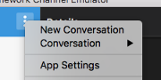

# From a "botsociety.io designed bot" to "functional Bot"
https://botsociety.io is a great design tool for Chat-Bots - very simple, intuitive and effient.
But in Botsociety it is not possible to test the different Connectors and real interaction with small devices. For UX tests it is important to test the bot-conversation with real users on different devices.

A small tool to extract botsociety bots to JSON and run it as a real chat-bot using Microsoft bot-framework.

## update
readme must be updated for
- deployment to testbot
- configurations of testbot

## Principle explained
- you create your own bot mockup or open an existing one using botsociety.io
- open your testbot index page and get "
- run a script inside "chrome" browser to capture all internal details of the Bot
- use the output and store it in a defined javascript file
- register a new bot at Microsoft (to get APP-ID and Password)
- run the bot locally with NodeJS or on server
- test it with different connectors: web, skype, slack, facebook

# Installations

## Preconditions to capture bot
- https://botsociety.io and register a free account
- login with your account. this is needed to run the scripts.
- create your own "bot mockups" and "edit" it
- or open link from a colleague and press "pause" it

## Preconditions to run bot
- installed nodejs (>6.0)
- clone / fork git repo locally

```
#!bash
git clone https://github.axa.com/pierre-loic-doulcet/botsociety-to-JSON
```

- register a new bot at https://dev.botframework.com/ (no need to deploy yet. just defining)
- create the needed APP-ID and APP-PASSWORD at botframework.com
- download https://docs.botframework.com/en-us/tools/bot-framework-emulator/  and run it locally
- download https://ngrok.com/
- configure the emulator

  

  
- copy _env file to .env
- adapt according to the Microsoft Botframework settings
  ```
  #!bash
  //document following entries. they will be used as process.env.*
  //please do not store .env file on GIT. .gitignore is already done
  MICROSOFT_APP_ID=....
  MICROSOFT_APP_PASSWORD=...
  //adapt the port if needed
  PORT=3978
  ```
- example bot entries are stored in 'converstation-simulation.js'
- run on command line
  ```
  #!bash
  cd botsociety-to-JSON
  npm install
  npm start
  ```
- to use automatic restart use nodemon, if you are able to install globally. If not use nodemon from local node_modules directory
  ```
  #!bash
  //install nodemon
  sudo npm install -g nodemon
  ./startnode.sh
  ```
- go to emulator
- run "new conversation"

  

  
- enter "start" in chat line
- then you should see this

  

# Deploy the bot to Azure
Make sure you always use https URLs!

- create Azure App Service

  

- define deployment credentials and save changes

  

- go to deployement options and configure required settings
    * choose Local Git Repository
    * click OK
- go to Application settings and add App settings
    * MICROSOFT_APP_ID
    * MICROSOFT_APP_PASSWORD
- go to Overview and copy 'Git clone url'
- add git remote repository paths
  ```
  #!bash
  git remote add azure YOUR_GIT_CLONE_URL_HERE
  ```
- execute the following commands to create a commit that contains all of your code
```
#!bash
  git add .
  git commit -m "the perfect code"
```
- execute the command to push your code to Azure. When prompted for a password, enter the one that you created erlier in the Azure portal (define deployment credentials)
```
#!bash
  git push azure master
```

# Capture your bot and run it
- login botsociety.io and open your bot
- copy content of (chrome/create-JSON-from-bot.js) file
- open "Developer tools, Source, Snippets" - new snippet
- past content of (chrome/create-JSON-from-bot.js) file
- run "snippet" via "content menu / run"
- copy  output in console from {{ ... }}
- paste a new file in [examples](./examples/)
- add new file entry into [conversation-simulation.js](conversation-simulation.js)
- start now using "npm start" or "nodemon"
- start chat-bot using Emulator

# Update bot after change in botsociety.io
- run script again in chrome
- copy
- paste in your file in [examples](./examples/)
- restart or autostart by nodemon
- "new conversation" or just type start
- iterate and iterate ...

# Examples
- [example on botsociety.io](https://botsociety.io/s/58deaf67cdf2eb63000d4fa3?b=58deb1a4cdf2eb63000d4fa6)
- generated files see [examples](examples/)


## How to add $ markers in texts
Issue with botsociety.io

To have a fully functional all-the-time working botsociety.io design, you have to invest a lot of time and especially if you want to verify the UX on all possible "choices".
**Important:** Markers are not really needed to have a functional demo. All choices with no further answers will proceed with 1st non empty answer.

Solution: use $ markers in texts.

1. **$.dialog-name.label-name**: use label markers in titles
2. **$=index**: in choices or quick-replies to use the same answer as index no
3. **$.dialog**: in choices or quick-replies to start 1st message of existing dialog (see no. 1)

examples
- "What is your favorite colour?": standard
- "What is your favorite colour? **$.Intro.willkommen**": additional label and dialog marker
- "Why do you like Green? **$.Intro.title**": additional label and dialog marker

  
- choices "blue|red|green": standard answers
- choices "blue **$=1**|red|green **$=1**": answers marked on 1st and 3rd answer to use the 2nd answer (index 1)

  
- choices "no I am happy|yes **$.Intro**": answer no 2 is opening dialog "Intro"

  


# Developer support
use the following options only for futher use of the "labels" or for debugging.

## How to configure Generator

following options are able to control the generation

DEBUG = true | false
- default = false
- if true, many console.log(...) are used to be able to inspect the real objects from botsociety.io

GENERATE_LABELS
- default = false, not needed for simulation
- true: will generate an addition console.entry with all texts captured in the dialogs
- use formatted information in all text fields as $.dialog-name.label-name - see [$ markers](#how-to-add-markers-in-texts)
- console entry can be used directly as locale.json file for localization